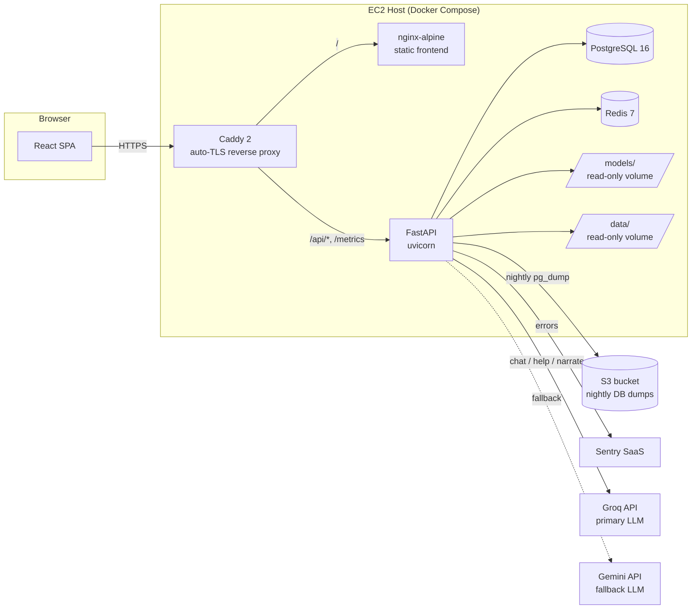
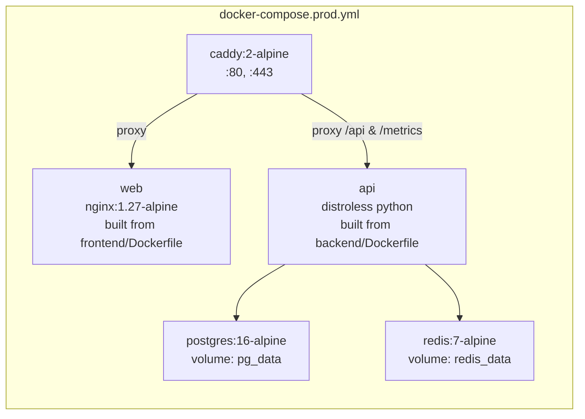
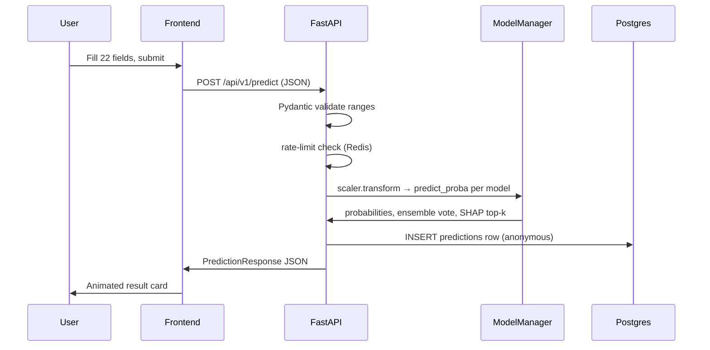
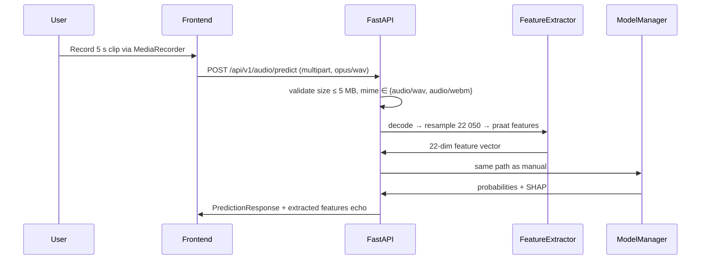
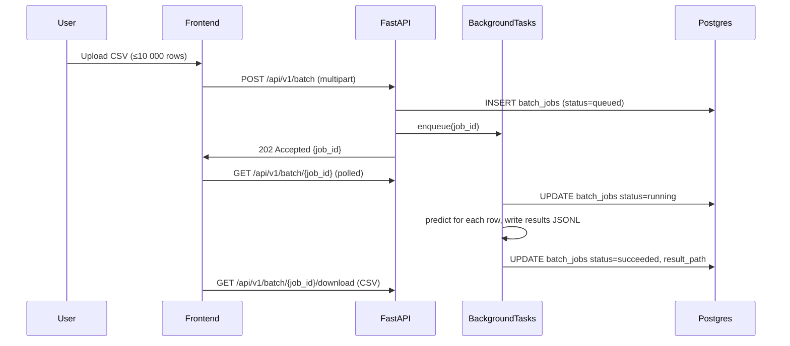
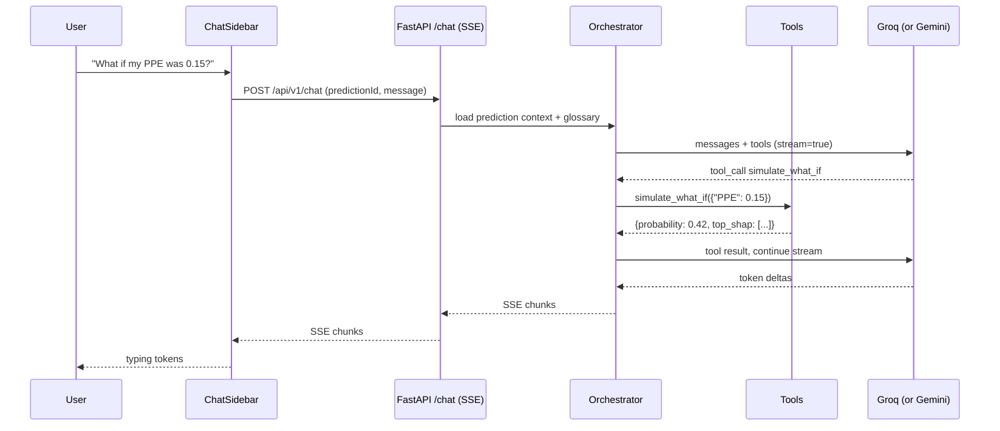
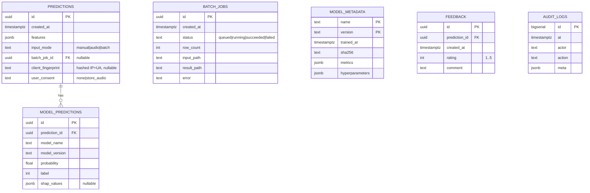
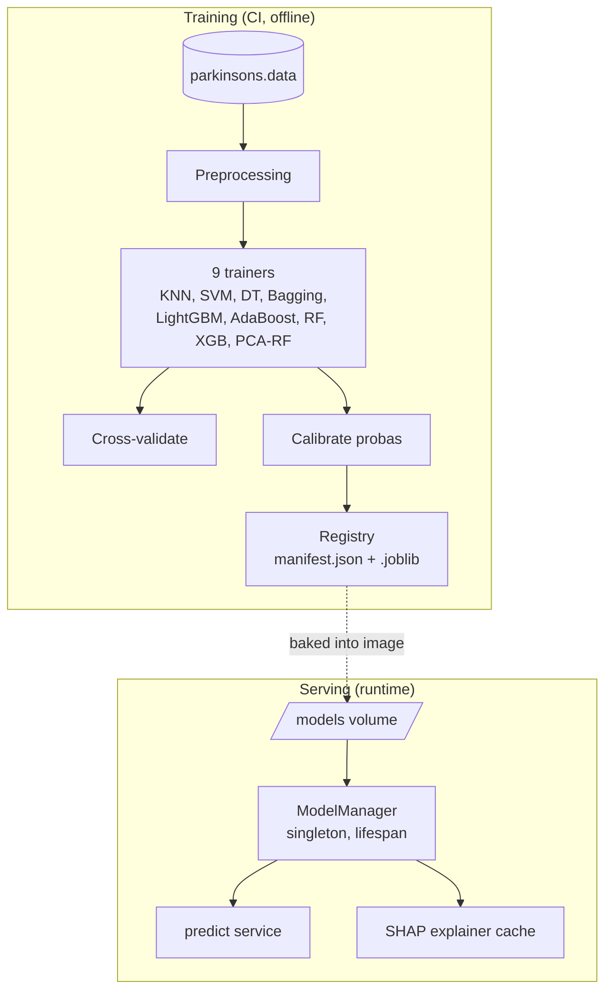
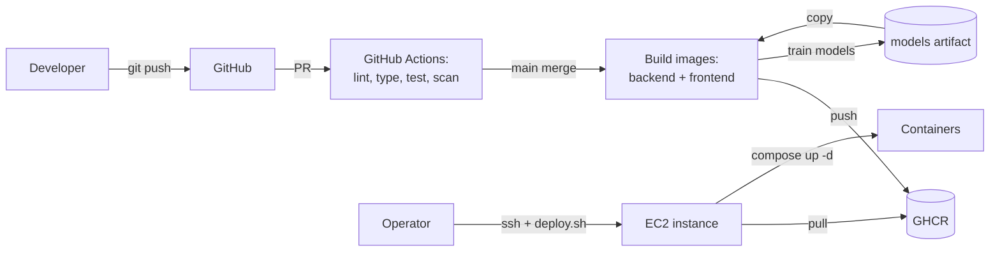

# 01 — High-Level Design

> **Reading order.** Start with `00_MASTER_PLAN.md` for context, then this file. After this, jump to whichever LLD applies to your task: `02_BACKEND_LLD.md`, `03_FRONTEND_LLD.md`, or `04_DEVOPS_LLD.md`.

---

## 1.1 System Overview

The system is a single-tenant web application that exposes a Parkinson's voice-disorder classifier through three primary user flows:

1. **Manual flow** — submit 22 numeric voice features → get a per-model prediction + an ensemble verdict + a SHAP explanation.
2. **Audio flow** — record / upload an audio clip → server extracts the 22 features with `parselmouth` → same prediction pipeline.
3. **Batch flow** — upload a CSV of feature vectors → background job → downloadable result CSV.

Supporting flows: dataset analytics, model-comparison studio, what-if sensitivity, PDF report download, admin dashboard.



---

## 1.2 Container / Service Topology



**Container responsibilities:**

| Service | Image | Ports (host:container) | Why |
|---|---|---|---|
| `caddy` | `caddy:2-alpine` | `80:80`, `443:443` | TLS termination, HTTP→HTTPS redirect, gzip, security headers. |
| `web` | built from `frontend/Dockerfile` (nginx-alpine final stage) | not exposed; behind Caddy | Serves the built React SPA. |
| `api` | built from `backend/Dockerfile` (distroless final stage) | not exposed; behind Caddy | FastAPI app. |
| `postgres` | `postgres:16-alpine` | not exposed | Application DB. |
| `redis` | `redis:7-alpine` | not exposed | Rate-limit store, query cache, future Celery broker. |

**Networks**: one bridge network. Only `caddy` is published to the host.

---

## 1.3 Tech Stack — Concrete Versions

> Lock to these versions in `pyproject.toml`, `package.json`, and Dockerfiles. Bumping a major requires an ADR.

### Backend
| Package | Version | Notes |
|---|---|---|
| Python | 3.11.x | distroless `gcr.io/distroless/python3-debian12` |
| fastapi | ~0.115 | |
| uvicorn[standard] | ~0.30 | |
| pydantic | ~2.9 | v2; settings via `pydantic-settings` |
| pydantic-settings | ~2.5 | |
| sqlalchemy | ~2.0 | async API |
| alembic | ~1.13 | |
| asyncpg | ~0.29 | prod driver |
| aiosqlite | ~0.20 | dev driver |
| python-multipart | ~0.0.12 | for upload endpoints |
| structlog | ~24.4 | JSON logging |
| prometheus-fastapi-instrumentator | ~7.0 | |
| sentry-sdk[fastapi] | ~2.14 | |
| slowapi | ~0.1.9 | rate limiting |
| passlib[bcrypt] | ~1.7 | admin password hashing |
| python-jose[cryptography] | ~3.3 | JWT for admin cookie |
| numpy | ~2.0 | |
| pandas | ~2.2 | |
| scikit-learn | ~1.5 | |
| lightgbm | ~4.5 | |
| xgboost | ~2.1 | |
| shap | ~0.46 | |
| praat-parselmouth | ~0.4.4 | |
| librosa | ~0.10 | |
| soundfile | ~0.12 | |
| joblib | ~1.4 | |
| openai | ~1.51 | OpenAI-compatible client used against Groq, Gemini, and OpenRouter |
| sse-starlette | ~2.1 | SSE responses for `/api/v1/chat` |
| google-generativeai | ~0.8 | Optional native Gemini SDK (not used in prod path) |

### Frontend
| Package | Version |
|---|---|
| node | 20 LTS |
| react | 18.3 |
| react-dom | 18.3 |
| typescript | 5.5 |
| vite | 5.4 |
| react-router-dom | 6.27 |
| @tanstack/react-query | 5.59 |
| zustand | 5.0 |
| react-hook-form | 7.53 |
| zod | 3.23 |
| tailwindcss | 3.4 |
| @radix-ui/react-* (via shadcn) | latest |
| recharts | 2.13 |
| visx (`@visx/*`) | 3.x |
| framer-motion | 11.x |
| @react-pdf/renderer | 4.x |
| openapi-typescript-codegen | 0.29 |
| vitest | 2.x |
| @testing-library/react | 16.x |
| @playwright/test | 1.48 |

### DevOps
| Tool | Version |
|---|---|
| docker | 27+ |
| docker compose | v2 |
| caddy | 2.x |
| postgres | 16 |
| redis | 7 |
| GitHub Actions runners | `ubuntu-24.04` |

---

## 1.4 Data Flows

### 1.4.1 Manual prediction (sync)



### 1.4.2 Audio prediction (sync, ~2 s)



### 1.4.3 Batch prediction (async)



### 1.4.4 LLM chat (grounded, streaming)



> Provider router transparently retries on Gemini if Groq is rate-limited or down (circuit breaker, 60 s open). See `06_LLM_INTEGRATION_LLD.md` §6.2.

### 1.4.5 Training pipeline (offline, in CI)

```mermaid
flowchart LR
    Raw[parkinsons.data] --> Pre[preprocessing.py<br/>fit_transform on train only]
    Pre --> Split[train_test_split<br/>stratified, seed=1]
    Split --> CV[5-fold stratified CV<br/>per model]
    CV --> Train[train_*.py<br/>fit on full train set]
    Train --> Cal[calibrate<br/>Platt scaling for SVM/KNN/DT]
    Cal --> Eval[evaluate<br/>acc/prec/rec/F1/ROC-AUC]
    Eval --> Save[joblib.dump<br/>+ SHA256 + metrics.json]
    Save --> Manifest[models/manifest.json]
    Manifest --> CI[(GitHub Actions artifact)]
    CI --> Image[docker build<br/>copies models/]
```



---

## 1.5 Data Architecture

### 1.5.1 Logical entities



### 1.5.2 Storage policy

- **No raw audio stored by default.** Audio is decoded into features in-memory and discarded.
- If `user_consent = 'store_audio'`, the audio is hashed and stored at `data/uploads/{sha256}.wav`. Disabled by default.
- IP addresses are never stored raw; only `sha256(ip + UA + daily_salt)` for daily-uniques.
- All PII-relevant fields default `NULL`.

### 1.5.3 Migrations

- Alembic. Initial migration captures the full schema.
- Naming: `YYYYMMDD_HHMM_short_description.py` via `alembic revision -m`.
- CI runs `alembic upgrade head` against an ephemeral Postgres before tests.

---

## 1.6 ML Architecture



**Model registry contract** — `models/manifest.json`:
```json
{
  "schema_version": 1,
  "scaler": {
    "path": "scaler.joblib",
    "sha256": "...",
    "feature_order": ["MDVP:Fo(Hz)", "MDVP:Fhi(Hz)", "..."]
  },
  "models": [
    {
      "name": "lightgbm",
      "version": "2026.04.30+1",
      "path": "lightgbm.joblib",
      "calibrator_path": null,
      "sha256": "...",
      "metrics": {
        "accuracy": 0.923,
        "precision": 0.906,
        "recall": 1.0,
        "f1": 0.951,
        "roc_auc": 0.978,
        "cv_accuracy_mean": 0.901,
        "cv_accuracy_std": 0.034
      },
      "hyperparameters": {"random_state": 1},
      "trained_at": "2026-04-30T18:42:11Z"
    }
  ]
}
```

The 9 models in scope (full notebook coverage):
1. KNN (k=5)
2. SVM (linear) + Platt calibration
3. Decision Tree (depth=2) + isotonic calibration
4. Bagging (DT depth=6, n=300)
5. LightGBM (defaults, seed=1)
6. AdaBoost (n=50)
7. Random Forest (n=30, entropy)
8. XGBoost (defaults)
9. PCA(9) → Random Forest (separate scaler/PCA pipeline)

Plus a synthetic **Ensemble** ("voting") that averages calibrated probabilities of the top-3 by CV accuracy.

---

## 1.7 Security & Privacy Architecture

> Detailed in `04_DEVOPS_LLD.md` §Security and `02_BACKEND_LLD.md` §Security.

| Concern | Approach |
|---|---|
| Transport | TLS 1.2+ via Caddy + Let's Encrypt; HSTS preload-eligible header. |
| CORS | `allow_origins=[settings.PUBLIC_BASE_URL]`; no `*`. |
| Headers | `X-Content-Type-Options: nosniff`, `X-Frame-Options: DENY`, `Referrer-Policy: strict-origin-when-cross-origin`, `Permissions-Policy: microphone=(self)`, CSP locked to self + inline-style hashes. |
| Auth | Public endpoints unauthenticated. `/api/v1/admin/*` and `/api/v1/feedback/*` (write) gated by JWT cookie issued after admin password login. |
| Rate limit | slowapi: 60 rpm/IP for `/predict`, 10 rpm/IP for `/audio/predict`, 5 rpm/IP for `/batch`, hashed to Redis. |
| Input validation | Pydantic v2 with explicit `ge`/`le` bounds per feature; reject NaN/Inf. |
| Upload limits | Audio ≤ 5 MB, 30 s max duration; CSV ≤ 2 MB, 10 000 rows max. |
| Pickle safety | Models loaded via joblib + SHA-256 verification against `manifest.json`. Manifest signed with HMAC for prod. |
| Secrets | `.env` in dev; AWS SSM Parameter Store in prod (mounted at boot via `setup.sh`). |
| Privacy | No raw audio retained without consent; hashed client fingerprint only. |
| Disclaimer | Persistent banner + first-visit modal + per-result banner. |
| Compliance | Not a HIPAA covered entity; no PHI accepted; ToS makes this explicit. |

---

## 1.8 Observability Architecture

```mermaid
flowchart LR
    BE[FastAPI app] -->|JSON stdout| DockerLogs[Docker logs]
    BE -->|/metrics| Prom[Prometheus]
    BE -->|exceptions| Sentry[Sentry]
    BE -->|spans (optional)| OTel[OTel collector]
    DockerLogs --> Loki[Loki<br/>optional Phase 5+]
    Prom --> Graf[Grafana<br/>optional Phase 5+]
```

**Three pillars**:
- **Logs**: structlog JSON to stdout; every request has a `request_id` (UUID4) injected into the log context and echoed in `X-Request-ID` response header.
- **Metrics**: `prometheus-fastapi-instrumentator` exposes `/metrics`. Custom counters: `predictions_total{model, label}`, `audio_extraction_seconds`, `batch_jobs_total{status}`.
- **Errors**: Sentry with release tag from git SHA; PII scrubbing on.

Health endpoints:
- `GET /api/v1/healthz` — liveness, returns 200 always while process is up.
- `GET /api/v1/readyz` — readiness, checks DB ping + model manifest loaded.

---

## 1.9 Deployment Architecture



- **Image tags**: `ghcr.io/<owner>/parkinsons-api:<git-sha>` and `:latest`. Same for `-web`.
- **Promotion**: `latest` tag is moved manually after smoke-test.
- **Rollback**: `deploy/deploy.sh` accepts a SHA; `docker compose pull && up -d` swaps the image.
- **Zero-downtime**: Caddy holds the connection while the new container starts; the old container drains. (For a true blue/green, Phase 5+ adds a parallel "candidate" upstream.)
- **Backups**: Cron in the `postgres` container runs `pg_dump | gzip | aws s3 cp` nightly.

---

## 1.10 Cross-Cutting Concerns

### 1.10.1 Configuration
- 12-factor: all config via environment.
- `Settings` class in `app/core/config.py` reads from env; throws on startup if a required var is missing.
- Frontend reads `import.meta.env.VITE_*` baked at build time.

### 1.10.2 Versioning
- API path-versioned: `/api/v1/...`. Breaking changes ⇒ `/api/v2`.
- Model versions: `YYYY.MM.DD+N` derived in CI from git tag + run number.
- Frontend release tag from git SHA, surfaced in the footer for support.

### 1.10.3 Internationalization
- All user-facing strings in `frontend/src/i18n/<locale>.json`.
- MVP ships `en.json` only; `react-i18next` plumbed so adding a locale is a one-PR change.

### 1.10.4 Theming
- CSS variables in `frontend/src/styles/tokens.css`; light + dark + system; Tailwind reads them via `theme.extend.colors`.

### 1.10.5 Accessibility
- WCAG 2.1 AA target.
- Semantic HTML; Radix primitives for focus management.
- `prefers-reduced-motion` respected by Framer Motion config.
- Lighthouse + axe-core in CI; fail PR if score drops below 90.

### 1.10.6 Performance budgets
- Frontend initial JS gzipped ≤ 250 KB; route-split everything past Home + Predict.
- Backend P95 manual predict ≤ 300 ms, audio predict ≤ 3 s.
- Postgres connection pool: 10 connections, 30 s timeout.

### 1.10.7 Error handling
- Backend: every HTTP error returned as `{"error": {"code": "...", "message": "...", "request_id": "..."}}`. Custom `AppException` hierarchy → uniform mapper.
- Frontend: TanStack Query error boundaries per page; global toast for unexpected errors with the `request_id` so a user can copy-paste to support.

---

## 1.11 What lives where (cheat sheet)

| Topic | Doc | Section |
|---|---|---|
| Why a tech choice | `00_MASTER_PLAN.md` | §0.6 |
| Architecture diagram | this file | §1.2 |
| Pydantic schemas | `02_BACKEND_LLD.md` | §Schemas |
| API endpoint payloads | `02_BACKEND_LLD.md` | §Endpoints |
| Component spec | `03_FRONTEND_LLD.md` | §Pages |
| Dockerfile contents | `04_DEVOPS_LLD.md` | §Containers |
| Build order | `05_EXECUTION_ROADMAP.md` | (entire) |
| LLM provider routing & prompts | `06_LLM_INTEGRATION_LLD.md` | §6.2, §6.6 |
| Chat tool calling | `06_LLM_INTEGRATION_LLD.md` | §6.5.4, §6.5.10 |
