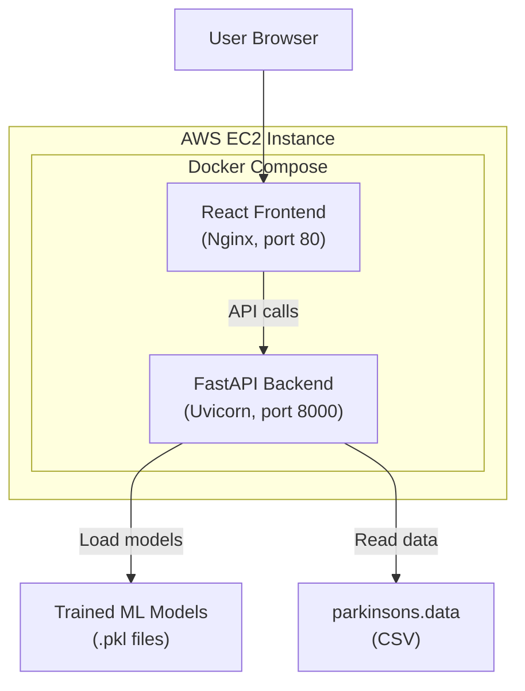

# Full-Stack Parkinson's Disease Voice Disorder Detection Web Application

## Background & Goal

Convert the existing Jupyter notebook (`DL_Parkinson_voice_disorders.ipynb`) into a production-grade full-stack web application with:
- **FastAPI** backend (Python) — serves ML models, handles predictions, provides data analytics APIs
- **React** frontend (Vite) — premium, modern UI for interacting with the models
- **EC2 deployment** — containerized with Docker, deployed on AWS

### What Exists Today

The notebook contains:
- **Dataset**: Parkinson's voice disorder dataset (195 samples, 22 features + 1 target `status`)
- **Feature columns** (22): `MDVP:Fo(Hz)`, `MDVP:Fhi(Hz)`, `MDVP:Flo(Hz)`, `MDVP:Jitter(%)`, `MDVP:Jitter(Abs)`, `MDVP:RAP`, `MDVP:PPQ`, `Jitter:DDP`, `MDVP:Shimmer`, `MDVP:Shimmer(dB)`, `Shimmer:APQ3`, `Shimmer:APQ5`, `MDVP:APQ`, `Shimmer:DDA`, `NHR`, `HNR`, `RPDE`, `DFA`, `spread1`, `spread2`, `D2`, `PPE`
- **Target**: `status` (1 = Parkinson's, 0 = Healthy) — column index 16
- **Preprocessing**: `StandardScaler`, 80/20 stratified train-test split (random_state=1)
- **Models trained** (5 total):
  1. **KNN** (k=5) — 87.18% accuracy
  2. **SVM** (linear kernel) — 82.05% accuracy
  3. **Decision Tree** (max_depth=2) — 84.62% accuracy
  4. **Bagging** (DT base, n_estimators=300, max_depth=6) — **92.31% accuracy** ⭐
  5. **LightGBM** — **92.31% accuracy** ⭐
- **Visualizations**: Confusion matrices via seaborn heatmaps
- Models are pickled to `.pkl` files

> [!WARNING]
> **Bug in notebook**: The test set is scaled using `sc.fit_transform(x_test)` instead of `sc.transform(x_test)`. This causes data leakage from the test set. The refactored code will fix this by only calling `fit_transform` on training data and `transform` on test data.

---

## User Review Required

> [!IMPORTANT]
> **AWS Credentials & EC2 Setup**: The deployment phase requires you to:
> 1. Have an AWS account with EC2 access
> 2. Create or provide an EC2 instance (recommended: t2.micro or t3.small, Ubuntu 22.04 AMI)
> 3. Have a key pair (.pem file) for SSH access
> 4. Configure security group to allow inbound traffic on ports 22 (SSH), 80 (HTTP), 443 (HTTPS)
> 5. Provide the public IP/DNS of the instance
>
> I will prepare all Docker and deployment configs, but the actual AWS provisioning and SSH deployment will need your credentials.

> [!IMPORTANT]
> **Dataset**: The original notebook loads data from Kaggle (`/kaggle/input/parkinsons-disease-data-set/parkinsons.data`). I'll include the dataset in the repo under `backend/data/parkinsons.data` so the app is self-contained. Please confirm you have this CSV file available, or I'll download it from the Kaggle dataset.

---

## Open Questions

1. **Domain/SSL**: Do you want HTTPS configured (Let's Encrypt) on EC2, or is HTTP sufficient for now?
2. **Authentication**: Should the app have user login/signup, or is it a public tool?
3. **EC2 Instance**: Do you already have an EC2 instance provisioned, or should I include Terraform/CloudFormation scripts?
4. **Dataset location**: Should I download the parkinsons.data from Kaggle and bundle it, or do you have it locally?

---

## Proposed Architecture



---

## Proposed Project Structure

```
project-root/
├── backend/
│   ├── app/
│   │   ├── __init__.py
│   │   ├── main.py                 # FastAPI app entry point
│   │   ├── config.py               # Settings & configuration
│   │   ├── models/
│   │   │   ├── __init__.py
│   │   │   ├── schemas.py          # Pydantic request/response models
│   │   │   └── ml_models.py        # Model loading & inference logic
│   │   ├── routers/
│   │   │   ├── __init__.py
│   │   │   ├── predict.py          # Prediction endpoints
│   │   │   ├── analytics.py        # Dataset analytics endpoints
│   │   │   └── models.py           # Model comparison endpoints
│   │   ├── services/
│   │   │   ├── __init__.py
│   │   │   ├── training.py         # Model training pipeline (from notebook)
│   │   │   ├── preprocessing.py    # Data preprocessing
│   │   │   └── evaluation.py       # Model evaluation metrics
│   │   └── utils/
│   │       ├── __init__.py
│   │       └── helpers.py
│   ├── data/
│   │   └── parkinsons.data         # Dataset CSV
│   ├── trained_models/             # Serialized model files (generated)
│   ├── scripts/
│   │   └── train_models.py         # CLI script to retrain all models
│   ├── requirements.txt
│   ├── Dockerfile
│   └── tests/
│       ├── __init__.py
│       ├── test_predict.py
│       └── test_training.py
├── frontend/
│   ├── src/
│   │   ├── main.jsx
│   │   ├── App.jsx
│   │   ├── api/
│   │   │   └── client.js           # Axios API client
│   │   ├── components/
│   │   │   ├── Layout/
│   │   │   │   ├── Navbar.jsx
│   │   │   │   ├── Sidebar.jsx
│   │   │   │   └── Footer.jsx
│   │   │   ├── Prediction/
│   │   │   │   ├── PredictionForm.jsx
│   │   │   │   └── PredictionResult.jsx
│   │   │   ├── Dashboard/
│   │   │   │   ├── ModelComparison.jsx
│   │   │   │   ├── ConfusionMatrix.jsx
│   │   │   │   ├── FeatureImportance.jsx
│   │   │   │   └── DatasetStats.jsx
│   │   │   └── common/
│   │   │       ├── Card.jsx
│   │   │       ├── Button.jsx
│   │   │       └── Loading.jsx
│   │   ├── pages/
│   │   │   ├── HomePage.jsx
│   │   │   ├── PredictPage.jsx
│   │   │   ├── DashboardPage.jsx
│   │   │   └── AboutPage.jsx
│   │   ├── styles/
│   │   │   ├── index.css
│   │   │   ├── variables.css
│   │   │   └── components.css
│   │   └── hooks/
│   │       └── usePrediction.js
│   ├── public/
│   ├── index.html
│   ├── package.json
│   ├── vite.config.js
│   ├── Dockerfile
│   └── nginx.conf
├── docker-compose.yml
├── deploy/
│   ├── setup.sh                    # EC2 initial setup script
│   └── deploy.sh                   # Deployment script
├── .gitignore
├── .env.example
└── README.md
```

---

## Proposed Changes

### Phase 1: Backend (FastAPI)

#### [NEW] backend/app/main.py
- FastAPI application with CORS middleware
- Lifespan event to load all ML models on startup
- Health check endpoint
- Include routers for predictions, analytics, and model comparison

#### [NEW] backend/app/config.py
- Pydantic `Settings` class with environment variable support
- Paths to data files, model files, and app configuration

#### [NEW] backend/app/services/preprocessing.py
- Extract the data loading and preprocessing pipeline from the notebook
- `load_dataset()` — loads `parkinsons.data` CSV
- `preprocess_features(df)` — separates features (22) from target (`status`)
- `get_scaler()` — fits and returns `StandardScaler` on training data
- **Fix the data leakage bug**: only `fit_transform` on train, `transform` on test

#### [NEW] backend/app/services/training.py
- Convert notebook model training cells into clean Python functions
- `train_knn(X_train, y_train)` → KNN with k=5
- `train_svm(X_train, y_train)` → SVM with linear kernel
- `train_decision_tree(X_train, y_train)` → DT with max_depth=2
- `train_bagging(X_train, y_train)` → BaggingClassifier with DT base (max_depth=6, n_estimators=300)
- `train_lgbm(X_train, y_train)` → LGBMClassifier
- `train_all_models()` — orchestrates training, saves models + scaler to `trained_models/`

#### [NEW] backend/app/services/evaluation.py
- `evaluate_model(model, X_test, y_test)` → returns accuracy, confusion matrix, precision, recall, F1
- `compare_all_models()` → evaluates all models and returns comparison table

#### [NEW] backend/app/models/schemas.py
- `PredictionRequest` — 22 voice feature fields with validation
- `PredictionResponse` — prediction result, confidence, model used
- `ModelComparisonResponse` — list of model metrics
- `DatasetStatsResponse` — feature statistics, class distribution

#### [NEW] backend/app/models/ml_models.py
- `ModelManager` class — loads all pickled models and scaler on startup
- `predict(features, model_name)` — runs inference through selected model
- `get_available_models()` — lists loaded models with metadata

#### [NEW] backend/app/routers/predict.py
- `POST /api/predict` — accepts 22 features, optional model selector, returns prediction
- `POST /api/predict/batch` — accepts CSV/array of samples for batch prediction
- `GET /api/predict/sample` — returns a random sample from dataset for demo purposes

#### [NEW] backend/app/routers/analytics.py
- `GET /api/analytics/dataset-stats` — feature statistics (mean, std, min, max)
- `GET /api/analytics/feature-distribution/{feature}` — histogram data for a feature
- `GET /api/analytics/class-distribution` — Parkinson's vs healthy count
- `GET /api/analytics/correlation` — feature correlation matrix

#### [NEW] backend/app/routers/models.py
- `GET /api/models` — list all available models with their accuracy metrics
- `GET /api/models/{model_name}/confusion-matrix` — confusion matrix data
- `GET /api/models/compare` — side-by-side model comparison

#### [NEW] backend/scripts/train_models.py
- CLI script: `python -m scripts.train_models`
- Trains all models, saves to `trained_models/`
- Prints evaluation summary

#### [NEW] backend/requirements.txt
```
fastapi>=0.104.0
uvicorn[standard]>=0.24.0
pandas>=2.0.0
numpy>=1.24.0
scikit-learn>=1.3.0
lightgbm>=4.0.0
pydantic>=2.0.0
pydantic-settings>=2.0.0
python-multipart>=0.0.6
python-dotenv>=1.0.0
joblib>=1.3.0
```

#### [NEW] backend/Dockerfile
- Python 3.11 slim base image
- Install requirements
- Copy application code
- Run model training on build (or provide pre-trained models)
- CMD: `uvicorn app.main:app --host 0.0.0.0 --port 8000`

---

### Phase 2: Frontend (React + Vite)

#### Frontend Pages & Features

1. **Home Page** — Hero section with project overview, key statistics, CTA to predict
2. **Predict Page** — Form with 22 voice features, model selector dropdown, real-time prediction result with visual indicator (healthy/Parkinson's), confidence gauge
3. **Dashboard Page** — Interactive charts:
   - Model accuracy comparison bar chart
   - Confusion matrices for each model
   - Feature importance visualization
   - Dataset distribution charts
4. **About Page** — Project info, research paper reference, team credits

#### Design System
- **Dark theme** with medical/scientific aesthetic
- **Color palette**: Deep navy (#0a0f1e), electric blue (#3b82f6), emerald green (#10b981) for healthy, amber (#f59e0b) for caution, red (#ef4444) for Parkinson's positive
- **Typography**: Inter font from Google Fonts
- **Glassmorphism** cards with subtle backdrop blur
- **Smooth animations** using CSS transitions and keyframes
- **Responsive** layout using CSS Grid and Flexbox

#### Key Frontend Files

#### [NEW] frontend/src/App.jsx
- React Router setup with 4 pages
- Global layout with Navbar and Footer

#### [NEW] frontend/src/pages/PredictPage.jsx
- Interactive form with grouped feature inputs (Frequency, Jitter, Shimmer, Other)
- Model selector dropdown (KNN, SVM, DT, Bagging, LightGBM)
- "Load Sample" button to auto-fill with dataset sample
- Animated result card showing prediction + confidence

#### [NEW] frontend/src/pages/DashboardPage.jsx
- Uses Recharts library for interactive charts
- Model comparison bar chart
- Tabbed confusion matrices
- Feature correlation heatmap
- Class distribution pie chart

#### [NEW] frontend/src/api/client.js
- Axios instance with base URL from environment variable
- Request/response interceptors for error handling

#### [NEW] frontend/Dockerfile
- Node 20 build stage → production build
- Nginx stage → serve static files + proxy `/api` to backend

#### [NEW] frontend/nginx.conf
- Serve React build from `/`
- Proxy `/api/*` requests to backend service on port 8000

---

### Phase 3: Docker & Deployment

#### [NEW] docker-compose.yml
```yaml
services:
  backend:
    build: ./backend
    ports:
      - "8000:8000"
    volumes:
      - ./backend/data:/app/data
      - ./backend/trained_models:/app/trained_models
    environment:
      - ENVIRONMENT=production
  
  frontend:
    build: ./frontend
    ports:
      - "80:80"
    depends_on:
      - backend
```

#### [NEW] deploy/setup.sh
- EC2 initial setup: install Docker, Docker Compose
- Configure firewall (ufw)
- Clone repo, build and start containers

#### [NEW] deploy/deploy.sh
- Pull latest code
- Rebuild and restart containers
- Zero-downtime deployment

#### [NEW] .gitignore
- Python: `__pycache__/`, `*.pyc`, `.env`, `venv/`, `trained_models/*.pkl`
- Node: `node_modules/`, `dist/`
- IDE: `.vscode/`, `.idea/`

#### [NEW] README.md (updated)
- Project overview with screenshots
- Setup instructions (local dev + Docker)
- API documentation
- Deployment guide

---

## Execution Order

1. **Backend core** — preprocessing, training, model manager
2. **Backend API** — FastAPI endpoints
3. **Backend tests** — verify endpoints work
4. **Frontend scaffold** — Vite + React setup
5. **Frontend pages** — Home, Predict, Dashboard, About
6. **Frontend styling** — Premium dark theme with animations
7. **Docker** — Dockerfiles + docker-compose
8. **Integration testing** — full stack locally
9. **Deployment configs** — EC2 setup/deploy scripts

---

## Verification Plan

### Automated Tests
- **Backend**: `pytest` for API endpoints (prediction, analytics, model comparison)
- **Backend**: verify all 5 models load and produce predictions
- **Frontend**: `npm run build` to verify no build errors

### Manual Verification
- Run `docker-compose up` locally and test:
  - Submit prediction form → get result
  - Dashboard charts render correctly
  - Model comparison shows all 5 models
  - API returns proper JSON responses
- Test on EC2 after deployment

### Browser Testing
- Navigate to the app in the browser
- Test prediction flow end-to-end
- Verify responsive layout on different screen sizes
